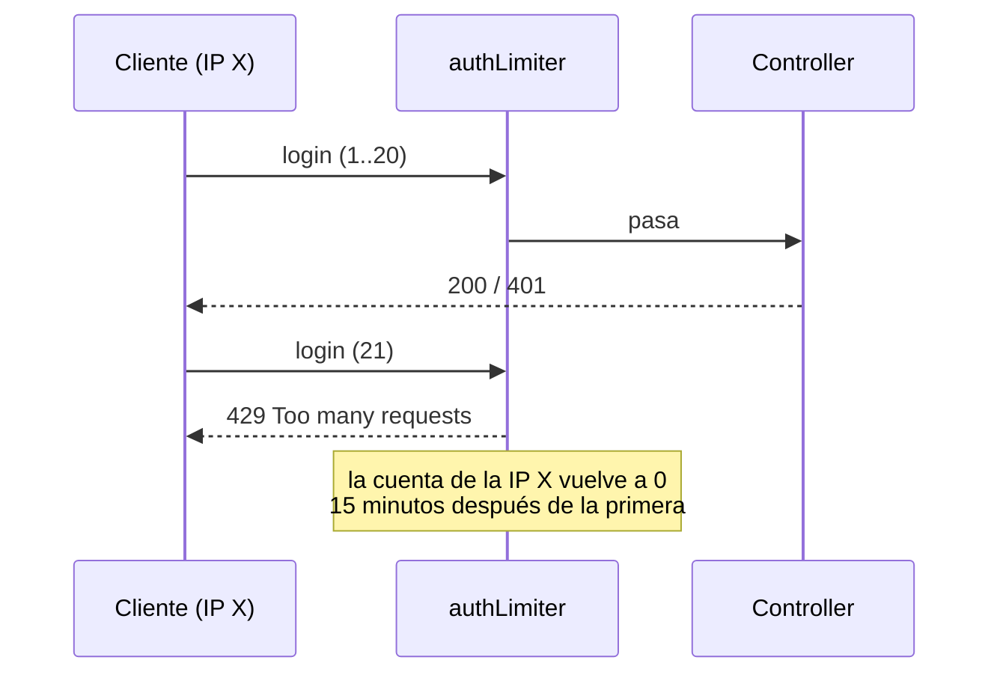

# API

Base: api/CLAUDE.md tiene el detalle completo de convenciones; esta página es el resumen de referencia rápida.

## Endpoints actuales

```
GET  /api/health           -> health check
GET  /api/users            -> lista de usuarios (requiere auth)
POST /api/users/create     -> registro
POST /api/users/login      -> login (devuelve JWT)
GET  /api/users/current    -> usuario actual (requiere auth)
GET  /api/users/profile    -> alias de /current (requiere auth)
GET  /api/regions/suggest  -> autocompletado de regiones (Redis)
GET  /api/regions/children -> hijos de una región (Redis)
```

Estos son los únicos endpoints que existen hoy. Los del MVP (publicar un alojamiento, listarlos) todavía no están construidos — ver `product-vision.md` para qué hace falta.

## Autenticación

- JWT en header Authorization: `Bearer <token>`.
- Token sin expiración todavía (pendiente: expiración + refresh).
- Sin roles: no hay roles de producto ([ADR 007](ADRs.md)). El campo `role` que aún tiene el schema de `User` (y el JWT) se retira al implementar `Listing`. Anfitrión es quien tiene al menos un `Listing`.
- Middleware auth en utils/middleware.js.

## Límite de peticiones

Protege contra el prueba y error de contraseñas y contra el abuso de escrituras
(`express-rate-limit`, en `utils/rateLimit.js`). Cuenta **por IP** y en ventanas
de 15 minutos; al pasarse, responde `429 Too many requests`.

| Limitador | Rutas | Máximo |
|-----------|-------|--------|
| `authLimiter` | `POST /api/users/login`, `POST /api/users/create` | 20 |
| `writeLimiter` | `POST /api/listings` | 30 |



**Detrás de un proxy, la IP hay que leerla bien.** En Render, la api está detrás de
un proxy: sin ayuda, todas las peticiones parecerían venir de la IP del proxy y el
límite bloquearía a todos los usuarios a la vez. Por eso `app.js` activa
`trust proxy` (`1` salto) **solo** con `NODE_ENV=production`, y así `express` usa la
IP real del usuario (`X-Forwarded-For`).

**Cuándo se salta el límite** (`skip` en `rateLimit.js`):

| Caso | Se salta |
|------|----------|
| `NODE_ENV=test` (tests de `api` y e2e de la CI) | Sí |
| `NODE_ENV=development` con `RATE_LIMIT=off` (opt-out explícito en local) | Sí |
| `NODE_ENV=production`, con o sin `RATE_LIMIT=off` | **Nunca**: la variable se ignora |

Por defecto el límite está siempre encendido.

## Manejo de errores

- express-async-errors captura errores async automáticamente.
- Middleware errorHandler centralizado.
- No usar try/catch en controllers — se propaga al error handler. Sí se puede usar en models para logging puntual.
