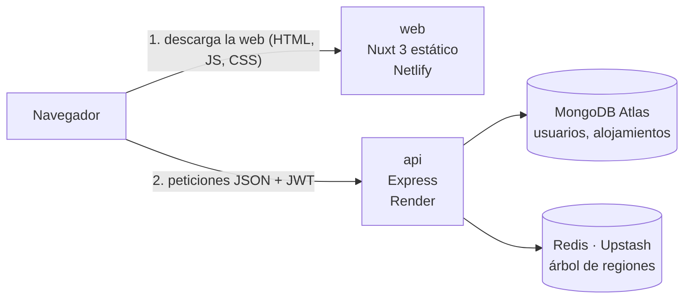
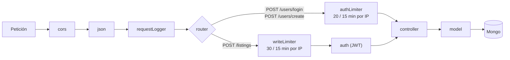

# Arquitectura

## Diagrama de alto nivel



- `web`: SSG/Nuxt, se sirve estático desde Netlify (CDN), sin servidor Node corriendo en producción para el frontend.
- Como la web es estática, **las llamadas a la api las hace el navegador**, no un servidor de `web`. Por eso la URL de la api (`NUXT_PUBLIC_API_BASE`) queda escrita dentro del build.
- `api`: Express corriendo como Web Service en Render, habla con Mongo Atlas (datos de negocio: usuarios y alojamientos) y con Redis/Upstash (el árbol de regiones).
- No hay comunicación directa entre `web` y las bases de datos — todo pasa por `api`.

## Por dónde pasa una petición en la api



Los limitadores van **antes** que `auth`: así se frena el prueba y error con contraseñas y también el abuso de quien no tiene sesión. Ver [API.md § Límite de peticiones](API.md).

## web — capas internas

```
web/
  core/
    httpClient.ts           <- cliente $fetch con la baseURL de la api
    services/repository/
      fetchFactory.ts       <- clase base HTTP (antes HttpFactory)
      modules/
        auth.ts             <- AuthModule
        region.ts           <- RegionModule
    types.ts                <- re-exporta los tipos (nunca .d.ts)
    types/                  <- interfaces por dominio
  composables/
    useAuthToken.ts         <- wrapper de useCookie() para el JWT
    useRegionSuggest.ts, useRegionCascade.ts, ...
  stores/                   <- Pinia: auth, region, global, adFlow
  plugins/
    services.ts             <- provee $services (auth, region)
  sentry.client.config.ts
```

Detalle y reglas de estilo: `micasaestuya-web/CLAUDE.md`. Parte de lo que hay en
`web` (`adFlow`, `core/types/property.ts`, `core/models/Property.ts`) es del
modelo anterior al pivote; ver [status.md](status.md).

## api — capas internas

```
routes/        -> define rutas, llama al controller
controllers/    -> lógica HTTP (req/res)
models/         -> lógica de negocio + queries Mongoose
schemas/        -> Mongoose schemas
utils/          -> config, logger, middleware, redisClient
```

Regla: no hay lógica de negocio en routes/controllers, ni queries Mongoose fuera de models/.

## Por qué estas decisiones

Ver [Decisiones (ADRs)](ADRs.md).
