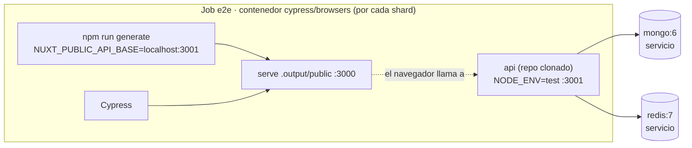

# CI/CD

Corre en GitHub Actions. Los tres repos siguen el mismo patrón: `.github/workflows/ci.yml` + `dependabot.yml`; web y api añaden además `codeql.yml`.

## web (`.github/workflows/ci.yml`)

Jobs, todos en `ubuntu-latest`:

| Job | Cuándo corre | Qué hace |
|-----|---------------|----------|
| lint | todo menos push a main | npm run lint (Node 20) |
| test-unit | todo menos push a main | Vitest + cobertura, sube el reporte como artifact |
| build | siempre | `npm run generate` (build estático), sube `.output/public` como artifact |
| e2e | todo menos push a main | Cypress en 2 shards contra una **API efímera** (mongo y redis vacíos, `api` clonada y arrancada con `NODE_ENV=test`); ver abajo |
| accessibility | todo menos push a main | pa11y-ci sobre el build estático (`continue-on-error`, no bloquea) |
| publish-docker | solo push a main | build + push a `ghcr.io/marlonbdez/micasaestuya-web` |

Nota: lint/test/build corren con Node 20; la imagen Docker (`Dockerfile.prod`) usa Node 22-alpine. Es una diferencia real, no un error de esta página — ver [Decisiones (ADRs)](ADRs.md) ADR 004.

### El job e2e

Lo que conviene saber:

- **Nunca habla con producción.** Antes apuntaba a la API de Render: los tests creaban usuarios en la base real y todos salían de la misma IP, así que el límite de peticiones devolvía `429` ([ADR 008](ADRs.md)).
- **Cada shard genera su propio build** (`npm run generate`). La URL de la api queda escrita dentro del build estático, así que no sirve reutilizar el del job `build`, que apunta a producción a propósito.
- **`api` se clona de `main`** del repo `micasaestuya-api` (público, sin token) y se arranca con `NODE_ENV=test`, que salta el límite de peticiones.
- **Todo en un solo paso.** El job corre en un `container:` y cada paso es su propio `docker exec`: un proceso lanzado con `&` no sobrevive al paso siguiente. Por eso la api, el servidor estático, la espera y Cypress van en el mismo `run` (detalle en `micasaestuya-web/docs/tooling.md` § 4).
- `continue-on-error: true` sigue puesto: un fallo de e2e no bloquea la PR. Se quitará cuando lleve un tiempo estable.

## api (`.github/workflows/ci.yml`)

| Job | Cuándo corre | Qué hace |
|-----|---------------|----------|
| lint | todo menos push a main | npm run lint (Node 22) |
| test | todo menos push a main | npm test, contra contenedores efímeros `mongo:6` / `redis:7-alpine` |
| publish-docker | solo push a main | build + push a `ghcr.io/marlonbdez/micasaestuya-api`, sin consumidor (Render construye desde GitHub) |

## infra (`.github/workflows/ci.yml`)

| Job | Qué hace |
|-----|----------|
| validate | valida `docker-compose.yml`, `.env.example` y los JSON de `seed/` |
| docker-build | `docker compose build` (continue-on-error) |

## CodeQL (web y api)

`codeql.yml` corre análisis de seguridad estático (JS/TS) en cada push/PR a main y en cron semanal.

## Dependabot (los tres repos)

`dependabot.yml` abre PRs semanales para dependencias npm, imágenes Docker y GitHub Actions.

## Nota sobre `develop`

Los tres workflows disparan también en push/PR a `develop`, pero esa rama no existe todavía en ninguno de los tres repos — hoy solo hay `main`. Ver [Entornos y ramas](Environments-and-Branches.md).

Ver también: [Infraestructura y despliegue](Infrastructure-and-Deployment.md)

## Por qué no hay Code Climate: la complejidad la mide ESLint

Cuando la CI vivía en GitLab, el informe de Code Quality lo generaba Code
Climate. GitLab lo deprecó en la 17.3 (y lo elimina en la 19.0), así que en vez
de afinar una herramienta con fecha de caducidad se pasó la métrica de
complejidad al propio ESLint, con la regla `complexity` (`['error', 10]` en el
`.eslintrc.cjs` de web). Antes había dos herramientas opinando con criterios
distintos sobre el mismo código; ahora hay una sola.

Con la migración a GitHub Actions desapareció el informe en sí: el job `lint`
solo ejecuta `npm run lint`, y un exceso de complejidad hace fallar el job en
vez de aparecer en un informe aparte. El formato `--format gitlab` ya no se usa.
