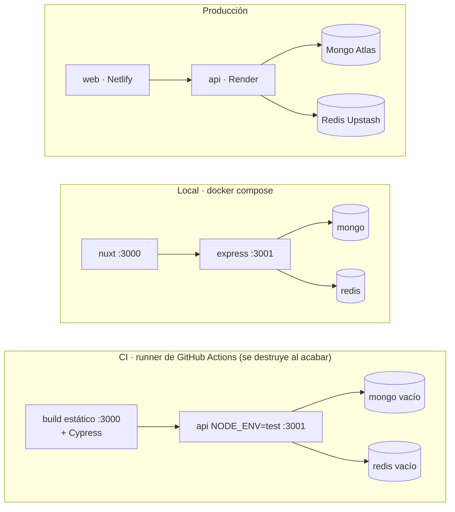

# Entornos y ramas

Hay un solo entorno **desplegado** (producción). Los demás son para desarrollar y
probar, y **ninguno toca datos de producción**.

| Entorno | Rama | web | api | Mongo | Redis | Para qué |
|---------|------|-----|-----|-------|-------|----------|
| Producción | main | Netlify (micasaestuya.com) | Render (micasaestuya-api.onrender.com) | Atlas | Upstash | Usuarios reales |
| Local | cualquiera | localhost:3000 | localhost:3001 | Mongo en docker-compose | Redis en docker-compose | Desarrollar y probar a mano |
| CI: e2e (efímero) | cualquiera menos main | build estático servido en el runner | `api` clonada, `NODE_ENV=test` | contenedor `mongo:6` vacío | contenedor `redis:7` | Tests de Cypress |
| CI: tests de `api` (efímero) | cualquiera menos main | — | — | contenedor `mongo:6` | contenedor `redis:7` | `npm test` |
| Staging | — (no existe) | — | — | — | — | Ver "Staging" más abajo |

**Efímero** significa que se crea al empezar la ejecución de la CI y se destruye al
terminar: base de datos vacía cada vez, nada que limpiar y nada que se pueda romper.

Los tres bloques están **aislados**: ninguno comparte base de datos con otro. Esa es
la regla que se busca: **los tests nunca hablan con producción**
([ADR 008](ADRs.md)).

## Staging: qué es y cuándo hace falta

Un entorno de staging es una copia permanente de producción (su propia web, api y
bases de datos) para probar **antes** de desplegar: migraciones, cambios de
esquema, ajustes de base de datos con datos parecidos a los reales.

Hoy no hace falta para los e2e (para eso sirve el entorno efímero de la CI), y es
más trabajo de mantener del que compensa con tan pocos usuarios. Se montará cuando
haya que **probar cambios de base de datos antes de aplicarlos en producción**.

| Opción | Cómo sería | Ventaja | Inconveniente |
|--------|-----------|---------|---------------|
| Efímero en la CI | Lo que hay hoy | Gratis, aislado, reproducible | No prueba Render ni Atlas reales, ni datos "de verdad" |
| Staging completo | Segundo servicio en Render, otro proyecto de Atlas y otra base de Upstash; rama `develop` | Ensayo real de despliegues y migraciones | Más cosas que mantener; los planes gratuitos se duermen |
| Base de staging en el mismo clúster de Atlas | Una base `micasaestuya-staging` junto a la de producción | Barato | Comparte clúster y credenciales con producción: un error de configuración puede tocarla. **No recomendado** |

Cuando se monte, el camino natural es el staging completo con `develop` como rama de
staging (los tres workflows de la CI ya disparan también en `develop`, aunque esa
rama todavía no existe).
