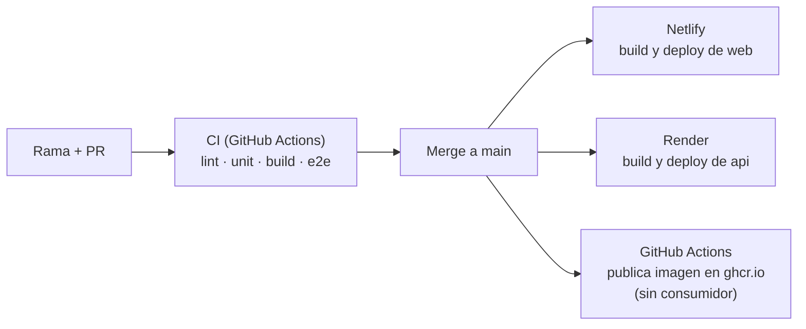

# Infraestructura y despliegue

| Servicio | Plataforma | Cómo despliega | URL |
|----------|-----------|-----------------|-----|
| web | Netlify | Build+deploy nativo desde el repo de GitHub, directo desde main. No usa Docker. | https://www.micasaestuya.com |
| api | Render.com | Web Service conectado al repo de GitHub (`marlonbdez/micasaestuya-api`). | https://micasaestuya-api.onrender.com |
| MongoDB | MongoDB Atlas | Cluster de producción. | — |
| Redis | Upstash | Base de producción. | — |

k8s: abandonado, no se usa.

## Cómo llega un cambio a producción

- Netlify y Render **despliegan solos al fusionar en `main`**, cada uno desde su repo.
- **Orden al tocar `api` y `web` a la vez:** `api` primero y se fusiona antes, porque Render despliega `api` al fusionar y `web` puede depender de un endpoint nuevo.
- Los tests de la CI no despliegan nada ni tocan producción; ver [Entornos y ramas](Environments-and-Branches.md).

## Container Registry: GitHub Container Registry (ghcr.io)

| Repo | Path del registry | Estado |
|------|--------------------|--------|
| api | ghcr.io/marlonbdez/micasaestuya-api | Publicado, sin consumidor (Render construye desde el repo de GitHub, no desde la imagen). |
| web | ghcr.io/marlonbdez/micasaestuya-web | Publicado, sin consumidor (Netlify no usa Docker). |
