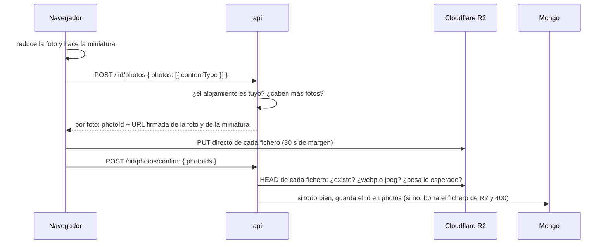

# Listing — especificación para `api`

> **Estado: implementado** en `api` (`POST /api/listings`, PR #20 de `api`;
> `GET /api/listings` y `GET /api/listings/:id`) y conectado desde Publicar en
> `web` (PR #31 de `web`). Si el código y este
> documento no coinciden, manda el código; avísalo aquí.

Un `Listing` es el alojamiento que publica un anfitrión: qué ofrece, qué tareas
pide a cambio y cuántas personas caben a la vez (`product-vision.md` § Qué es el
MVP). Los campos son exactamente los del formulario de `web`
(`micasaestuya-web/pages/publish-listing/index.vue`) y los tipos salen de
`micasaestuya-web/core/types/listing.ts`.

## Schema (`schemas/listing.js`)

| Campo         | Tipo                  | Obligatorio | Reglas                                                                                                |
| ------------- | --------------------- | ----------- | ----------------------------------------------------------------------------------------------------- |
| `title`       | String                | sí          | `trim`, 1–100 caracteres                                                                              |
| `region`      | Subdocumento `region` | sí          | Ver [Región](#región)                                                                                 |
| `description` | String                | sí          | `trim`, no vacío                                                                                      |
| `tasks`       | [String]              | sí          | Al menos 1. Enum: `COOKING`, `GARDENING`, `CLEANING`, `CHILDCARE`, `PET_CARE`, `MAINTENANCE`, `OTHER` |
| `capacity`    | Number                | sí          | Entero, 1–20                                                                                          |
| `whatsapp`    | String                | sí          | `+`, código de país y número, sin espacios: `^\+[1-9]\d{7,19}$`                                       |
| `photos`      | [String]              | no          | Por defecto `[]`. Ver [Fotos](#fotos)                                                                 |
| `owner`       | ObjectId → `User`     | sí          | Lo pone la API desde el token, nunca el cliente                                                       |
| `createdAt`   | Date                  | automático  | `timestamps: true`                                                                                    |
| `updatedAt`   | Date                  | automático  | `timestamps: true`                                                                                    |

`toJSON` como en `User`: `_id` pasa a `id` y se quita `__v`.

`web` ya envía el WhatsApp normalizado (sin espacios ni guiones, en
`stores/listingDraft.ts` · `toCreateInput`), pero la API valida igual: el
cliente no es de fiar.

### Región

Se guarda con la misma forma que ya produce `RegionCascade` en `web` (el tipo
`IAdRegion`, que es `IRegion` sin `highlighted_text`). No es una forma nueva:

```js
region: {
  country_code: String, // 'CU' | 'DO', obligatorio
  level1: String,       // provincia, obligatorio
  level2: String,       // municipio
  level3: String,       // localidad (CU) o sector (DO)
  level_type: Number,   // 1 | 2 | 3: cuántos niveles hay, obligatorio
  term: String          // "Matanzas, Cárdenas, Varadero", para pintar
}
```

- **Nunca lleva calle ni coordenadas** (`Domain-Vocabulary.md`). Si algún día
  hacen falta, irán en un `address` al lado de `region`, no dentro.
- `level_type` tiene que coincidir con los niveles rellenos.
- **La región llega hasta el último nivel que existe en su rama.** `web` no deja
  publicar a medias. La API debería comprobarlo contra el árbol en memoria que ya
  usa `/regions/children` (`data/regions_*.json`): si el último nivel enviado
  tiene hijos, es un 400. Así la validación no depende de que el cliente se
  porte bien.

### Fotos

Decisión en el [ADR 009](ADRs.md): las fotos viven en **Cloudflare R2** y en Mongo
solo van los ids de las fotos. Publicar ya las sube (web #36): mientras se publica, las que
elige el anfitrión esperan en su navegador (IndexedDB).

**Reglas del producto**

- De **1 a 10 fotos** por alojamiento (el máximo habitual en Airbnb, Workaway y
  Worldpackers).
- Cada foto se optimiza en el navegador antes de subirla: **WebP** (JPEG de reserva
  si el navegador no sabe codificar WebP), lado mayor de **1600 px** (buen tamaño
  sin pasarse, el mismo que ya usaba `useImageResize` antes de esta decisión, solo
  que ahora en WebP) y sin EXIF, más una **miniatura de 400 px** para Explorar
  (el tamaño habitual de una tarjeta en rejilla).

**Cómo se sube, ya implementado** (`api` #24)


```mermaid
sequenceDiagram
  participant N as Navegador
  participant A as api
  participant R as Cloudflare R2
  participant M as Mongo
  N->>N: reduce la foto y hace la miniatura
  N->>A: POST /:id/photos { photos: [{ contentType }] }
  A->>A: ¿el alojamiento es tuyo? ¿caben más fotos?
  A-->>N: por foto: photoId + URL firmada de la foto y de la miniatura
  N->>R: PUT directo de cada fichero (30 s de margen)
  N->>A: POST /:id/photos/confirm { photoIds }
  A->>R: HEAD de cada fichero: ¿existe? ¿webp o jpeg? ¿pesa lo esperado?
  A->>M: si todo bien, guarda el id en photos (si no, borra el fichero de R2 y 400)
```

- `POST /:id/photos`: hasta 10 fotos por alojamiento (contando las que ya tenga).
- `POST /:id/photos/confirm`: solo pasan fotos `image/webp` o `image/jpeg` de como
  mucho 1 MB, y miniaturas de como mucho 100 KB (holgado sobre lo que sale de
  `web` a 1600 px y 400 px). La firma no puede limitar el peso, así que se
  comprueba aquí. Confirmar la misma foto dos veces no la duplica.
- `DELETE /:id/photos/:photoId`: quita el id y borra los dos ficheros de R2.
- La `api` no recibe los ficheros: el servidor de Render es pequeño y no debe
  cargar con imágenes. Mongo solo guarda `photos: [String]` con el `photoId` de cada foto; la `api`
  compone la URL pública al responder (`R2_PUBLIC_URL` + `listings/<id>/<photoId>`),
  así que cambiar de dominio no obliga a migrar la base.
- El nombre de cada fichero lo pone la `api` (`listings/<id>/<photoId>`, con un
  UUID que genera ella), nunca el cliente.

**Reglas de seguridad**

- `POST /api/listings` **ignora** `photos` si llega en el body, para que nadie
  pueda meter URLs arbitrarias.
- Un alojamiento ajeno o inexistente da el mismo `404` en los tres endpoints de
  fotos, para no distinguir uno de otro.
- Si se quita una foto o se borra el alojamiento, se borra también el fichero de
  R2 (si no, quedan huérfanos ocupando espacio). **El borrado del alojamiento
  todavía no existe** como endpoint: mientras tanto, si un alojamiento se queda
  huérfano de fotos por un fallo a medio publicar, se deja así (ver `status.md`).

**Pendiente**

- El dominio público de las imágenes: `r2.dev` es para pruebas; en producción
  conviene uno propio ([Runbook DNS](Runbook-DNS-Cloudflare.md)).

## Endpoint de creación

```
POST /api/listings
Authorization: Bearer <token>        (mismo JWT que /api/users/*)
Content-Type: application/json
```

Ruta con el middleware `auth` ya existente, como en el ejemplo de
`micasaestuya-api/CLAUDE.md` § Rutas:
`listingRouter.post('/', auth, ListingController.create)`.

**Body:**

```json
{
  "title": "Casa con jardín en Playa Girón",
  "region": {
    "country_code": "CU",
    "level1": "Matanzas",
    "level2": "Ciénaga de Zapata",
    "level3": "Playa Girón",
    "level_type": 3,
    "term": "Matanzas, Ciénaga de Zapata, Playa Girón"
  },
  "description": "Casa tranquila cerca del mar…",
  "tasks": ["COOKING", "GARDENING"],
  "capacity": 2,
  "whatsapp": "+5351234567"
}
```

**Respuestas:**

| Código | Cuándo                                | Body                                                                |
| ------ | ------------------------------------- | ------------------------------------------------------------------- |
| 201    | Creado                                | El `Listing` completo (`id`, `owner`, `photos: []`, `createdAt`, …) |
| 400    | Falta un campo o no cumple las reglas | `{ "error": "..." }`, del `errorHandler` común (como `/api/users`)   |
| 401    | Sin token o token inválido            | Lo que ya devuelve el middleware `auth`                             |

`owner` sale de `req.user.id` (lo pone el middleware `auth`); si viene en el
body, se ignora.

**En `web`:** la llamada vive en
`micasaestuya-web/core/services/repository/modules/listing.ts`.

## Endpoints de lectura

Públicos, sin token. Un alojamiento ya es público al publicarse, WhatsApp
incluido (lo dice la política de privacidad).

### `GET /api/listings`

Lo que pinta Explorar. Solo salen los alojamientos con **al menos una foto
confirmada**: la subida ocurre después de crear el alojamiento y puede fallar, y
`web` exige "mínimo 1" al publicar pero la `api` no puede garantizarlo.

- Orden: el más nuevo primero.
- Paginación: `?page=` (desde 1) y `?limit=` (por defecto 12, máximo 50). Un valor
  que no sea un entero positivo es un 400. Una página pasada del final da `items`
  vacío, no un error.
- Cada elemento lleva solo lo que pinta una tarjeta: `id`, `title`, `region`,
  `tasks`, `capacity` y `photos`. Sin `description` ni `whatsapp`.

```json
{ "items": [{ "id": "…", "title": "…", "region": {}, "tasks": [], "capacity": 2, "photos": [] }], "total": 25 }
```

`web` calcula si hay más páginas con `page * limit < total`. No hay filtros
todavía: se añaden cuando el uso real los pida.

### `GET /api/listings/:id`

El alojamiento completo. `owner` viene poblado con `{ id, firstName }`: solo el
nombre de pila, para pintar "Anfitrión: María" y para que `web` sepa si el
alojamiento es del usuario con sesión. Un id que no existe o mal formado da 404.

## Publicar y los roles

Decidido en el [ADR 007](ADRs.md): **no hay roles de producto** y `User.role`
se quita.

- Publicar no cambia nada en `User`.
- "Es anfitrión" se deduce de tener al menos un `Listing`
  (`Listing.exists({ owner })`); no se guarda aparte.
- La tarea que implemente `Listing` retira también `role`: del schema de
  `User`, del payload del JWT (`UserModel.login` y `UserModel.create`) y del
  tipo `IUserInfo` de `web`. Los documentos que ya lo tengan en Mongo no
  molestan: el campo se ignora al no estar en el schema.

### `GET /api/listings/mine`

Con token. Los alojamientos del usuario, los nuevos primero, con los mismos campos
que una tarjeta de Explorar. A diferencia de `GET /api/listings`, **incluye los que
no tienen fotos**: si la subida falló, quien publicó tiene que poder verlos y
terminarlos. Sin paginación: un anfitrión tiene pocos.

### `DELETE /api/listings/:id`

Con token, solo el dueño. Borra el alojamiento y, de R2, el fichero y la miniatura
de cada foto. El documento se borra primero: si R2 falla después quedan ficheros
huérfanos, nunca un alojamiento con fotos rotas. Ajeno, inexistente o mal formado:
404. Responde 204.

## Fuera de esta especificación

Editar (`PATCH`). Va con "Mis alojamientos", que es una tarea aparte.
