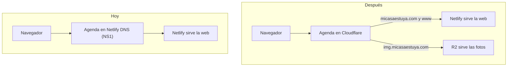

# Pasar el DNS de micasaestuya.com de Netlify a Cloudflare

**Para qué:** servir las fotos desde un subdominio propio (`img.micasaestuya.com`) con
la caché de Cloudflare. R2 solo permite un dominio propio si el dominio está como zona
en la misma cuenta de Cloudflare ([ADR 009](ADRs.md)). El `r2.dev` que da R2 sin
configurar está limitado y Cloudflare lo reserva para desarrollo.

**Cuándo:** antes de que haya usuarios reales viendo fotos. No antes: mientras tanto
todo se desarrolla con `r2.dev`.

**Regla de orden: el DNS se pasa antes de que se suba ninguna foto en producción.**
En Mongo se guarda la URL completa de cada foto, así que una foto subida en producción
con la URL de `r2.dev` quedaría apuntando a un dominio limitado. Si por lo que sea ya
hay alguna, hay que reescribir esas URLs en Mongo (o borrar los alojamientos de prueba)
al hacer el paso 6.

**Objetivo:** cero caída. La web tiene que seguir cargando en todo momento.

## Qué es el DNS, en una línea

El DNS es la agenda que dice en qué servidor está `micasaestuya.com`. Hoy la agenda la
guarda **Netlify** (NS1). Este procedimiento pasa la agenda a **Cloudflare**. Netlify
sigue construyendo, desplegando y sirviendo la web igual: solo deja de guardar la agenda.



## Estado de partida (comprobado el 27-09-2026)

| Dato | Valor |
|------|-------|
| Registrador | Launchpad.com (donde se compró el dominio) |
| Quién guarda la agenda | Netlify DNS: nameservers `dns1.p09.nsone.net` … `dns4.p09.nsone.net` |
| `micasaestuya.com` y `www` | Registros `A` con dos IP de Netlify y TTL de 5 s (las devuelve Netlify DNS de forma dinámica) |
| Correo (MX), TXT | **No hay**: no hay correo que romper |
| DNSSEC | **No activado** (no hay registro DS). Si lo estuviera, habría que quitarlo antes de cambiar los nameservers o la web dejaría de resolverse |

## Cómo se evita la caída

Los nameservers se cambian en el registrador y tardan en propagarse (de minutos a
unas horas): durante ese tiempo, unos usuarios consultan la agenda vieja y otros la
nueva. **No se nota nada si las dos dan la misma respuesta.** De ahí salen las tres
reglas de este procedimiento:

1. **Cloudflare se prepara y se prueba entero antes de cambiar nada.** No se tocan los
   nameservers hasta que Cloudflare, consultado directamente, responde bien.
2. **La zona de Netlify DNS no se toca ni se borra.** Sigue respondiendo bien mientras
   dura la propagación y sirve de vuelta atrás.
3. **Los registros que apuntan a Netlify, en "DNS only"** (nube gris, sin el proxy de
   Cloudflare). Netlify ya trae su propio CDN. Que dos CDN encadenados den problemas con
   el certificado es lo habitual, pero **no lo he verificado** en la documentación de Netlify:
   se comprueba en el paso 5.

## Pasos

Cada paso tiene su **comprobación**. Si falla, se para y no se sigue.

### 0. Preparación (sin cambiar nada)

- Abrir los registros del dominio en el panel de Netlify (Domains → DNS records) y
  **anotarlos todos** (captura de pantalla). Si hay algo aparte de `micasaestuya.com` y `www`
  (subdominios, TXT), también hay que recrearlo.
- Anotar los nameservers actuales del registrador (la vuelta atrás):
  `dns1.p09.nsone.net`, `dns2.p09.nsone.net`, `dns3.p09.nsone.net`, `dns4.p09.nsone.net`.
- Elegir un momento de poco tráfico y tener a mano el acceso a Launchpad, Netlify y Cloudflare.
- **Comprobación:** `dig +short DS micasaestuya.com` no devuelve nada (DNSSEC apagado).

### 1. Añadir el dominio a Cloudflare

- Cloudflare → Add a domain → `micasaestuya.com` → plan **Free**. Cloudflare escanea los
  registros existentes y asigna **dos nameservers** (`xxx.ns.cloudflare.com`). Anótalos.
- **Todavía no cambia nada:** mientras los nameservers del registrador no cambien, el mundo
  sigue usando la agenda de Netlify.

### 2. Dejar los registros como pide Netlify

Según [la documentación de Netlify para DNS externo](https://docs.netlify.com/manage/domains/configure-domains/configure-external-dns/):

| Tipo | Nombre | Destino | Proxy |
|------|--------|---------|-------|
| `CNAME` (Cloudflare lo aplana en el dominio raíz) | `@` | `apex-loadbalancer.netlify.com` | DNS only |
| `CNAME` | `www` | el subdominio de Netlify del sitio (`<sitio>.netlify.app`) | DNS only |

- **No copiar las dos IP actuales como registros `A` fijos.** Son lo que Netlify DNS
  contesta en cada momento (TTL de 5 s) y pueden cambiar.
- Borrar cualquier registro que Cloudflare haya importado y que no esté en lo anotado en el paso 0.
- **Comprobación:** los registros en Cloudflare coinciden con los anotados, todos en "DNS only".

### 3. Probar Cloudflare sin haber cambiado nada

Consultar directamente a los nameservers asignados por Cloudflare (`<ns>` = uno de ellos):

```bash
dig @<ns> micasaestuya.com A +short
dig @<ns> www.micasaestuya.com A +short
```

- **Comprobación:** devuelven IP de Netlify, y la web responde con esas IP:
  `curl -sI --resolve www.micasaestuya.com:443:<IP> https://www.micasaestuya.com | head -1` → `HTTP/2 200`.

### 4. Cambiar los nameservers en el registrador

- En Launchpad, cambiar los nameservers de `dns1…4.p09.nsone.net` a los **dos de Cloudflare**.
- Cloudflare avisa cuando el dominio pasa a **Active**.

### 5. Vigilar mientras se propaga

Lanzar esto en una terminal durante el cambio (debe verse `200` sin interrupción):

```bash
while true; do date +%T; curl -s -o /dev/null -w "%{http_code}\n" https://www.micasaestuya.com; sleep 5; done
```

- Preguntar a varios resolvedores públicos: `dig @1.1.1.1 www.micasaestuya.com +short`,
  `dig @8.8.8.8 …`, `dig @9.9.9.9 …`, y `dig NS micasaestuya.com +short` para ver desde cuándo
  ven los nameservers nuevos.
- **Comprobaciones:** la web responde `200` todo el rato; en Netlify (Domain settings) el
  dominio no marca errores y el **certificado HTTPS sigue válido**; en Cloudflare, **Active**.
  Si el certificado da problemas con los registros en "DNS only", se para y se revisa antes de seguir.

### 6. Después, sin prisa

- **No borrar la zona de Netlify DNS** hasta pasadas al menos 48 horas de estabilidad.
- En el bucket de producción de R2 → Settings → **Custom Domains** → `img.micasaestuya.com`.
- Cambiar en Render la variable de la URL pública de las fotos (`R2_PUBLIC_URL`) al dominio nuevo
  y comprobar que una foto carga. Solo las fotos subidas **desde ahora** usan el dominio
  nuevo. Si hubiera alguna anterior en producción, sus URLs de `r2.dev` hay que
  reescribirlas (ver la regla de orden del principio).

## Vuelta atrás

Volver a poner en el registrador los cuatro nameservers de NS1 anotados en el paso 0. La zona
de Netlify DNS sigue intacta, así que responde igual que antes. Tarda lo mismo en propagarse
(minutos u horas), y por eso la regla 2 es no borrarla.

## Riesgos

| Riesgo | Cómo se cubre |
|--------|---------------|
| Un registro mal copiado deja la web caída | Se prueba Cloudflare directamente (paso 3) antes de cambiar los nameservers |
| Propagación desigual: unos ven la agenda vieja y otros la nueva | Las dos dan la misma respuesta |
| DNSSEC activo y web sin resolver | Comprobado el 27-09-2026: no lo está (paso 0 lo repite) |
| Certificado HTTPS de Netlify | Netlify sigue emitiéndolo y renovándolo mientras los registros apunten a él; se comprueba en el paso 5 |
| Nube naranja de Cloudflare sobre los registros de Netlify | Todos en "DNS only" |
| Se pierde un registro que no estaba en la lista | Se anotan todos en el paso 0 y se comparan en el 2 |
